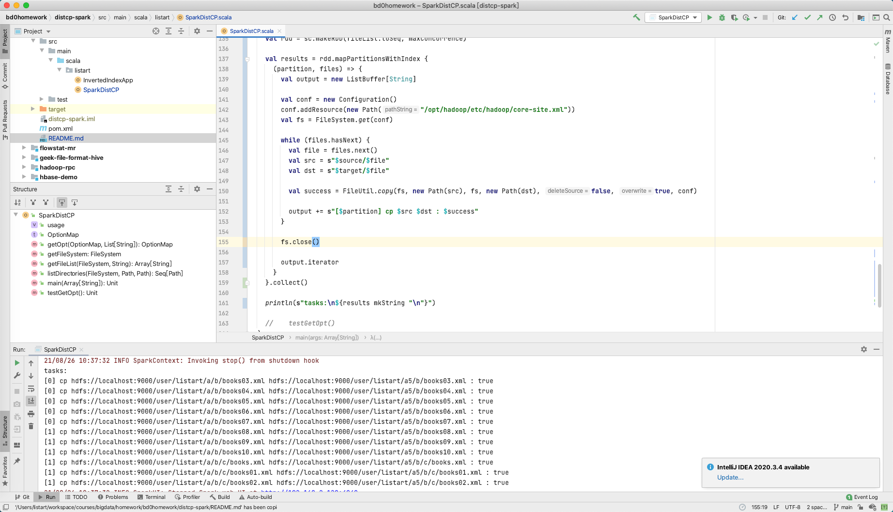

# Spark Core 编程作业

作业内容和要求见 https://u.geekbang.org/lesson/162?article=408443


## 排坑记录

### mapPartitionsWithIndex使用

1. 某名难懂的API说明，很容易造成提供的 `f` 参数函数返回值类型无法通过编译

   ```
   public <U> RDD<U> mapPartitionsWithIndex(scala.Function2<Object,scala.collection.Iterator<T>,scala.collection.Iterator<U>> f,
                                   boolean preservesPartitioning,
                                   scala.reflect.ClassTag<U> evidence$8)
   Return a new RDD by applying a function to each partition of this RDD, while tracking the index of the original partition.
   preservesPartitioning indicates whether the input function preserves the partitioner, which should be false unless this is a pair RDD and the input function doesn't modify the keys.
   
   Parameters:
   f - (undocumented)
   preservesPartitioning - (undocumented)
   evidence$8 - (undocumented)
   Returns:
   (undocumented)
   ```

   通过百度一些文档，发现该函数定义的重点在

   ```scala
   scala.Function2<Object,scala.collection.Iterator<T>,scala.collection.Iterator<U>>
   ```

   @param **Object** 分区号

   @param **Iterator\<T\>** 分区内数据 `Iterator`
   @result **Iterator\<U\>** 需要返回 `Iterator`

   因此，`f` 函数应提供 `Iterator` 类型，本质上也反映出 `mapPartition` 只是有特殊处理的 `map` 算子。

2. `f` 函数其实并不再 **driver** 中运行，因此需要为其分布式执行提供独立构造的 `FileSystem` 对象实例，不能共用 `driver` 中的 `FileSystem` 对象。


## 作业输出

### 第一题 使用RDD API实现带词频的倒排索引

源码见 [listart.InvertedIndexApp#main](src/main/scala/listart/InvertedIndexApp.scala)


输入文件 `distcp-spark/input/data`

```
0. "it is what it is"
1. "what is it"
2. "it is a banana"
```

输出文件 `distcp-spark/output/output/part-00000`

```
"a":	{(2,1)}
"banana":	{(2,1)}
"is":	{(0,2), (1,1), (2,1)}
"it":	{(0,2), (1,1), (2,1)}
"what":	{(0,1), (1,1)}
```


### 第二题 SparkDistCP

源码见 [listart.SparkDistCP#main](src/main/scala/listart/SparkDistCP.scala)

运行参数

```shell
-i -m 2 hdfs:/user/listart/a hdfs:/user/listart/a5
```




## 参考资料

1. [Inverted Index in Spark (scala)](https://www.slideshare.net/deanwampler/spark-the-next-top-compute-model-39976454/37-Inverted_Index_in_Spark_Scala) from slideshare.net
2. [Tutorial: Create a Scala Maven application for Apache Spark in HDInsight using IntelliJ](https://docs.microsoft.com/en-us/azure/hdinsight/spark/apache-spark-create-standalone-application) from microsoft.com

