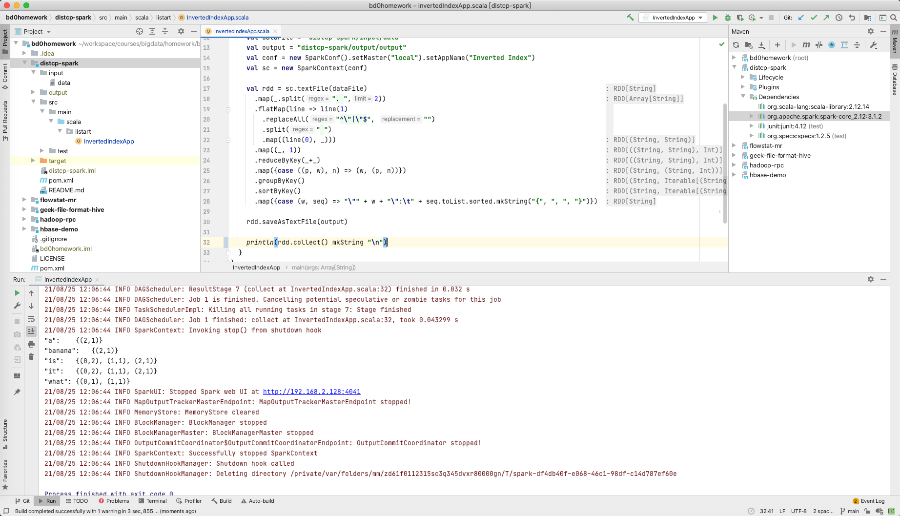

# Spark Core 编程作业

作业内容和要求见 https://u.geekbang.org/lesson/162?article=408443


## 排坑记录


## 作业输出

### 第一题 使用RDD API实现带词频的倒排索引

源码见 [listart.InvertedIndexApp#main](src/main/scala/listart/InvertedIndexApp.scala)



输入文件 `distcp-spark/input/data`

```
0. "it is what it is"
1. "what is it"
2. "it is a banana"
```

输出文件 `distcp-spark/output/output/part-00000`

```
"a":	{(2,1)}
"banana":	{(2,1)}
"is":	{(0,2), (1,1), (2,1)}
"it":	{(0,2), (1,1), (2,1)}
"what":	{(0,1), (1,1)}
```


## 第二题 Distcp


## 参考资料

1. [Inverted Index in Spark (scala)](https://www.slideshare.net/deanwampler/spark-the-next-top-compute-model-39976454/37-Inverted_Index_in_Spark_Scala) from slideshare.net
2. [Tutorial: Create a Scala Maven application for Apache Spark in HDInsight using IntelliJ](https://docs.microsoft.com/en-us/azure/hdinsight/spark/apache-spark-create-standalone-application) from microsoft.com

