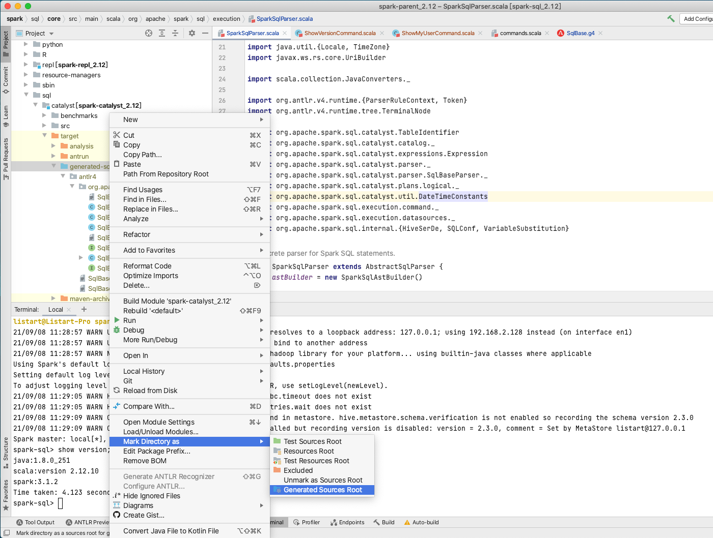
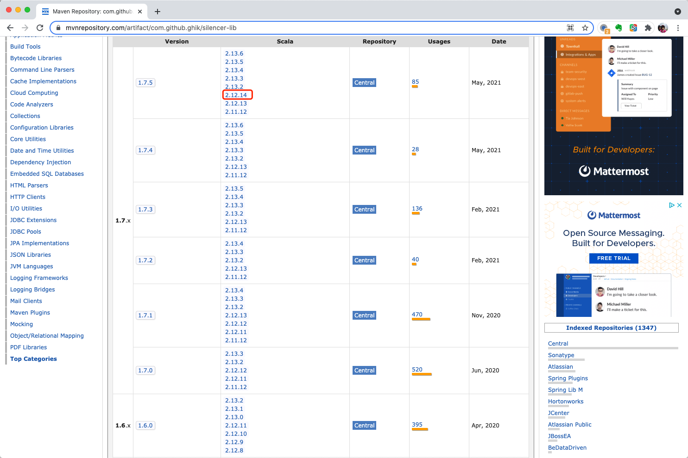
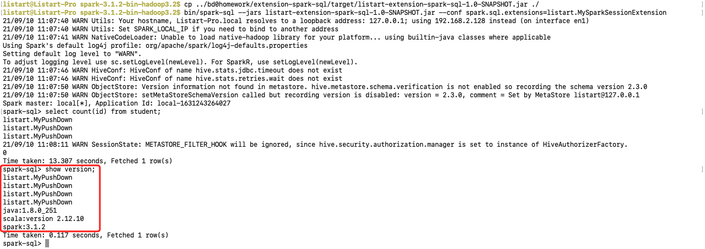
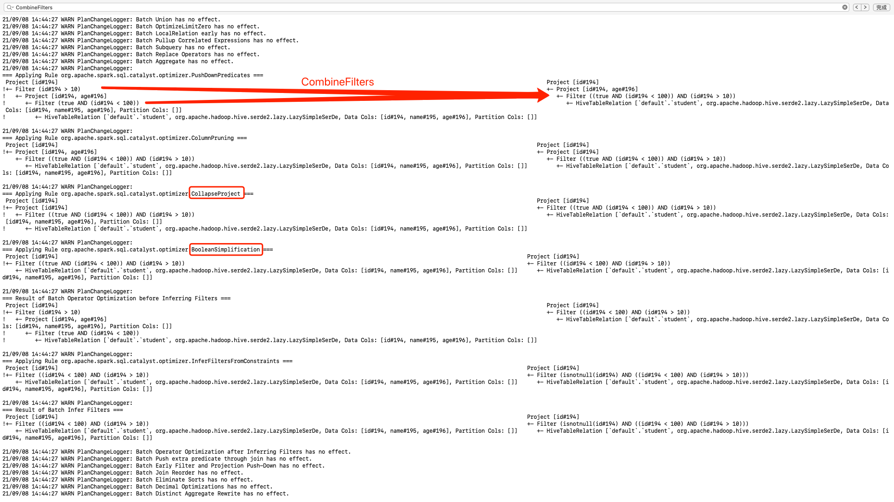
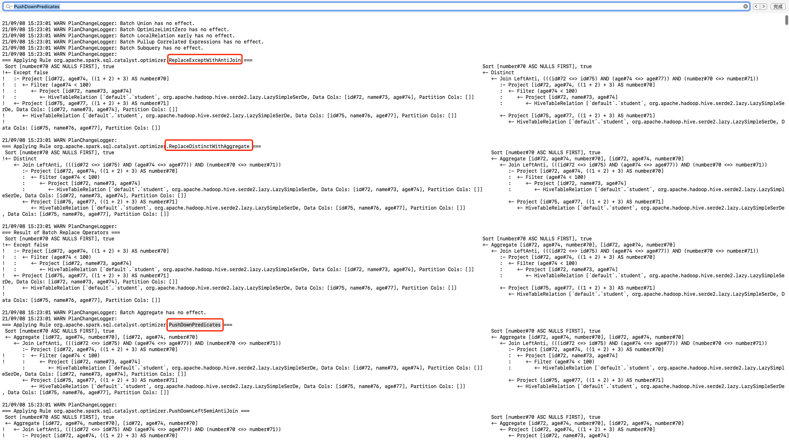
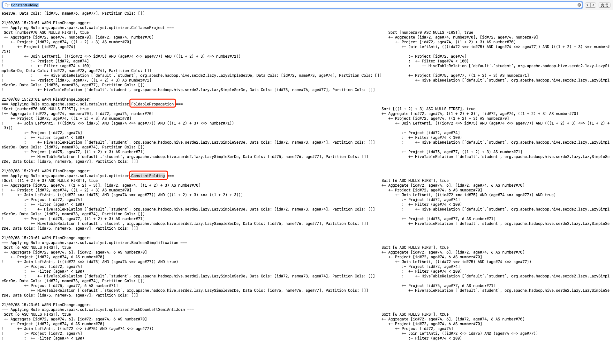
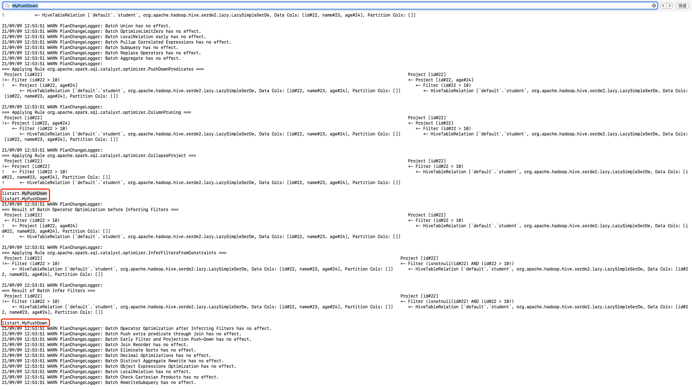

# 要求

详见 https://u.geekbang.org/lesson/162?article=413168


# 爬坑记录

## 无法导入 SqlBaseParser

现象描述：修改SqlBase.g4并利用antlr4插件重新生成，生成代码中，SqlBaseParser.java文件中确实产生了ShowVersionContext类，但是SparkSqlParser中无法关联到该文件。

解决方法：如下图，将生成目录 Mark Directory as -> Generated Sources Root




## 编译jar包总出错

- 原本模块使用的 **org.scala-tools.archetypes:scala-archetype-simple** 创建，使用的maven plugins包括 ***org.scala-tools:maven-scala-plugin*** ***org.apache.maven.plugins:maven-eclipse-plugin*** 及 ***org.specs:specs*** 依赖 都非常老，即使加上 ***org.scala-tools:maven-scala-plugin:2.15.2*** ***org.apache.maven.plugins:maven-eclipse-plugin:2.10*** 依赖，mvn package 时也会有出现各种问题。

  解决思路：直接将 **spark 3.1.2** 源码 **parent pom** 中的 ***net.alchim31.maven:scala-maven-plugin:4.3.0*** 和 ***org.apache.maven.plugins:maven-compiler-plugin:3.8.1*** 替换到模块。

- `mvn package` 时，***com.github.ghik:silencer-plugin_2.12.14:1.6.0*** 依赖缺失：

  到mvnrespository.com查看发现，***scala 2.12.14*** 版本较新，仅 `1.7.5` 版本支持，如下图所示。

  

  切换版本后，编译通过。


# 输出

## 第一题 Spark SQL 自定义命令

在课堂上直接修改 Spark Code 的基础上，参考 ***Delta Lake*** 相关代码，以扩展 `injectParser` 方式实现 ***Spark SQL*** 的 `show version` 命令扩展。

> - [io.delta.sql.parser.DeltaSqlParser](https://github.com/delta-io/delta/blob/master/core/src/main/scala/io/delta/sql/parser/DeltaSqlParser.scala) DeltaLake Spark SQL Parser 代码参考
>
> - [antlr4/io/delta/sql/parser/DeltaSqlBase.g4](https://github.com/delta-io/delta/blob/master/core/src/main/antlr4/io/delta/sql/parser/DeltaSqlBase.g4) DeltaLake Antlr4 g4 定义参考

代码列表：

- Antlr4 语法定义文件：[MySqlBase.g4](src/main/antlr4/listart/parser/MySqlBase.g4)
- Spark SQL 扩展点：[listart.MySparkSessionExtension](src/main/scala/listart/MySparkSessionExtension.scala)
- Spark SQL Parser 扩展实现： [listart.parser.MySqlParser](src/main/scala/listart/parser/MySqlParser.scala)
- show version 命令实现：[listart.command.ShowVersionCommand](src/main/scala/listart/command/ShowVersionCommand.scala)

执行命令

```shell
bin/spark-sql -S \
--jars listart-extension-spark-sql-1.0-SNAPSHOT.jar \
--conf spark.sql.extensions=listart.MySparkSessionExtension
```

执行结果




## 第二题 构建SQL

1. 构建一条SQL，同时apply下面三条优化规则: 

  - CombineFilters
  - CollapseProject
  - BooleanSimplification

  ```sql
  select id 
  from (
    select id, age 
    from student 
    where true and id < 100
  ) 
  where id > 10;
  ```

  

2. 构建一条SQL，同时apply下面五条优化规则:

   - ConstantFolding
   - PushDownPredicates
   - ReplaceDistinctWithAggregate
   - ReplaceExceptWithAntiJoin
   - FoldablePropagation

   ```sql
   select id,age,1+2+3 as number 
   from (
     select id, name, age from student
   ) where age < 100 
   except DISTINCT 
   select id,age,1+2+3 as number 
   from student 
   order by number;
   ```

   

   


## 第三题 自定义优化规则

代码列表

- [MyPushDown.scala](src/main/scala/listart/MyPushDown.scala)

- [MySparkSessionExtension.scala](src/main/scala/listart/MySparkSessionExtension.scala)


运行过程

- 启动 spark-sql

  ```shell
  bin/spark-sql -S \
  --jars listart-extension-spark-sql-1.0-SNAPSHOT.jar \
  --conf spark.sql.extensions=listart.MySparkSessionExtension
  ```

- spark-sql 内

  ```shell
  set spark.sql.planChangeLog.level=WARN;
  select id from (select id,age from student) where id > 10;
  ```

  运行截图

  

  

# 参考资料

1. [Writing custom optimization in Apache Spark SQL - custom parser](https://www.waitingforcode.com/apache-spark-sql/writing-custom-optimization-apache-spark-sql-custom-parser/read) AUGUST 15, 2019, BARTOSZ KONIECZNY
2. [How to Extend Apache Spark with Customized Optimizations](https://www.slideshare.net/databricks/how-to-extend-apache-spark-with-customized-optimizations) from Databricks
3. [Spark SQL operator optimizations - part 1](https://www.waitingforcode.com/apache-spark-sql/spark-sql-operator-optimizations-part-1/read) OCTOBER 14, 2017, BARTOSZ KONIECZNY
4. [io.delta.sql.parser.DeltaSqlParser](https://github.com/delta-io/delta/blob/master/core/src/main/scala/io/delta/sql/parser/DeltaSqlParser.scala) DeltaLake Spark SQL Parser 代码参考
5. [antlr4/io/delta/sql/parser/DeltaSqlBase.g4](https://github.com/delta-io/delta/blob/master/core/src/main/antlr4/io/delta/sql/parser/DeltaSqlBase.g4) DeltaLake Antlr4 g4 定义参考

