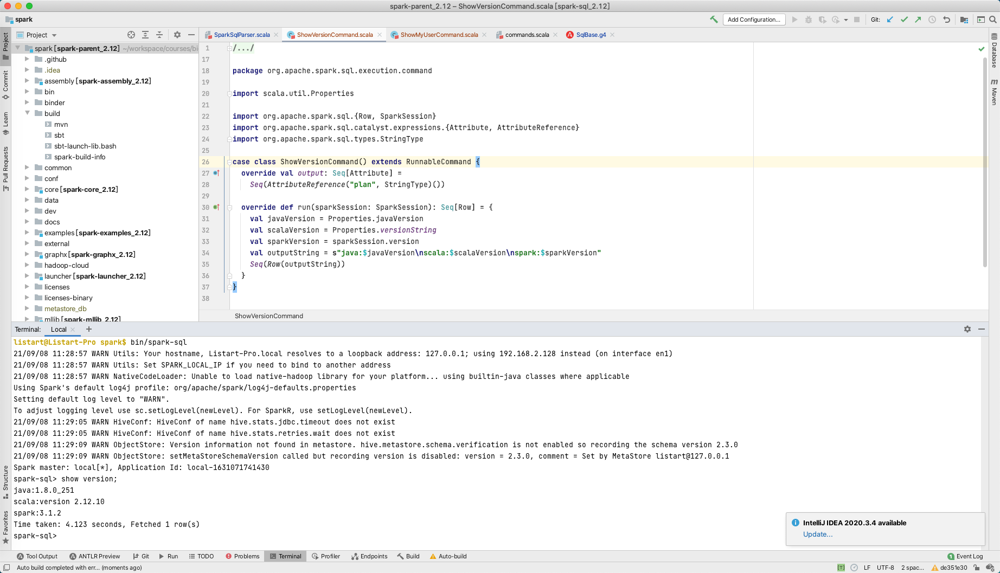

# 要求

详见 https://u.geekbang.org/lesson/162?article=413168


# 爬坑记录

## 无法导入 SqlBaseParser

现象描述：修改SqlBase.g4并利用antlr4插件重新生成，生成代码中，SqlBaseParser.java文件中确实产生了ShowVersionContext类，但是SparkSqlParser中无法关联到该文件。

解决方法：如下图，将生成目录 Mark Directory as -> Generated Sources Root


## 编译jar包总出错

- 原本模块使用的 **org.scala-tools.archetypes:scala-archetype-simple** 创建，使用的maven plugins包括 ***org.scala-tools:maven-scala-plugin*** ***org.apache.maven.plugins:maven-eclipse-plugin*** 及 ***org.specs:specs*** 依赖 都非常老，即使加上 ***org.scala-tools:maven-scala-plugin:2.15.2*** ***org.apache.maven.plugins:maven-eclipse-plugin:2.10*** 依赖，mvn package 时也会有出现各种问题。

  解决思路：直接将 **spark 3.1.2** 源码 **parent pom** 中的 ***net.alchim31.maven:scala-maven-plugin:4.3.0*** 和 ***org.apache.maven.plugins:maven-compiler-plugin:3.8.1*** 替换到模块。

- `mvn package` 时，***com.github.ghik:silencer-plugin_2.12.14:1.6.0*** 依赖缺失：

  到mvnrespository.com查看发现，***scala 2.12.14*** 版本较新，仅 `1.7.5` 版本支持，如下图所示。

  

  切换版本后，编译通过。


# 输出

## 第一题 Spark SQL 自定义命令

代码列表

- [SqlBase.g4](todo/antlr4/org/apache/spark/sql/catalyst/parser/SqlBase.g4)
- [SparkSqlParser.scala](todo/scala/org/apache/spark/sql/execution/SparkSqlParser.scala)
- [ShowVersionCommand.scala](todo/scala/org/apache/spark/sql/execution/command/ShowVersionCommand.scala)




## 第二题 构建SQL

1. 构建一条SQL，同时apply下面三条优化规则: 

  - CombineFilters
  - CollapseProject
  - BooleanSimplification

  ```sql
  select id 
  from (
    select id, age 
    from student 
    where true and id < 100
  ) 
  where id > 10;
  ```

  

2. 构建一条SQL，同时apply下面五条优化规则:

   - ConstantFolding
   - PushDownPredicates
   - ReplaceDistinctWithAggregate
   - ReplaceExceptWithAntiJoin
   - FoldablePropagation

   ```sql
   select id,age,1+2+3 as number 
   from (
     select id, name, age from student
   ) where age < 100 
   except DISTINCT 
   select id,age,1+2+3 as number 
   from student 
   order by number;
   ```

   

   


## 第三题 自定义优化规则

代码列表

[MyPushDown.scala](src/main/scala/listart/MyPushDown.scala)

[MySparkSessionExtension.scala](src/main/scala/listart/MySparkSessionExtension.scala)


# 参考资料

1. [Writing custom optimization in Apache Spark SQL - custom parser](https://www.waitingforcode.com/apache-spark-sql/writing-custom-optimization-apache-spark-sql-custom-parser/read) AUGUST 15, 2019, BARTOSZ KONIECZNY
2. [Spark SQL operator optimizations - part 1](https://www.waitingforcode.com/apache-spark-sql/spark-sql-operator-optimizations-part-1/read) OCTOBER 14, 2017, BARTOSZ KONIECZNY

