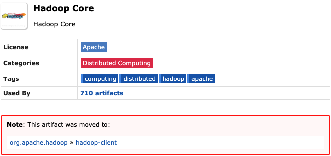
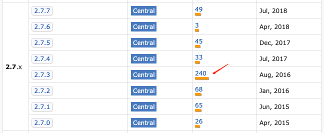
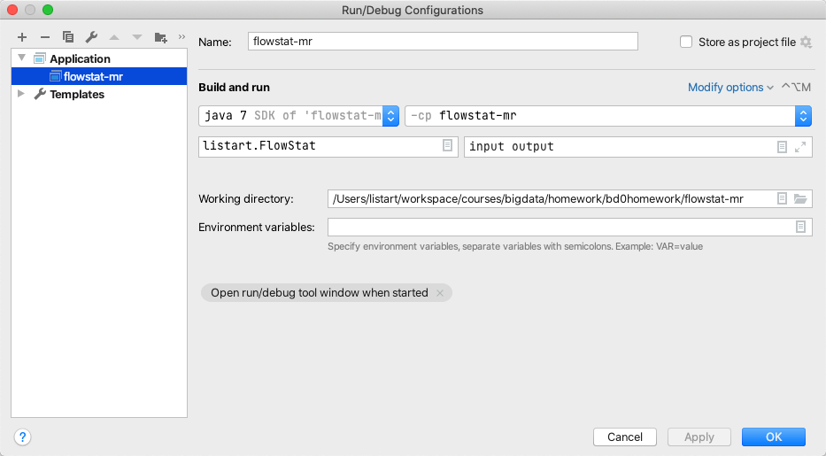
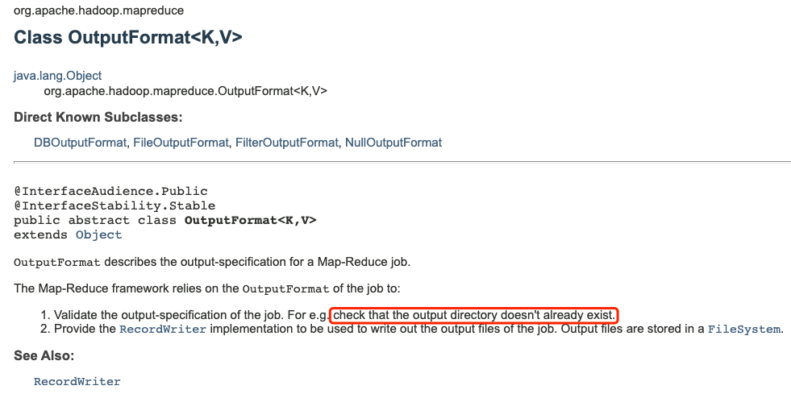
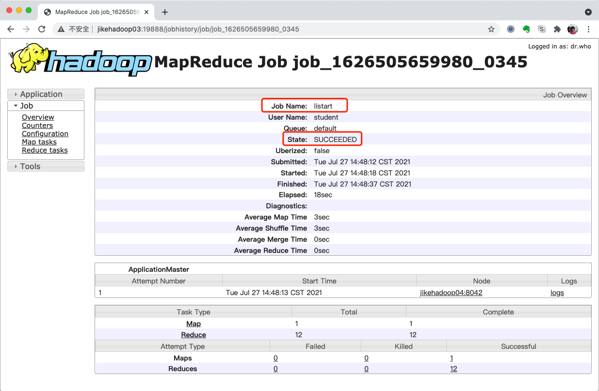

# MapReduce 编程作业

作业要求及内容详见

https://u.geekbang.org/lesson/162?article=394390


## 排坑日志

### hadoop-core源码无法下载问题

找到的IDEA参考资料实际已经比较陈旧，依赖库 `hadoop-core 1.2.1` 早已移到 [hadoop-client](https://mvnrepository.com/artifact/org.apache.hadoop/hadoop-client) 进行维护，因此源码已无法下载。




根据本地docker镜像支持的hadoop版本，使用一个最热门的 `hadoop-client 2.7.3` 。



```shell
# 拉取镜像
docker pull sequenceiq/hadoop-docker:2.7.1
```


### FileAlreadyExistsException

运行参数配置如下



第二次运行时，报如下错误：

```shell
Exception in thread "main" org.apache.hadoop.mapred.FileAlreadyExistsException: Output directory file:/Users/listart/workspace/courses/bigdata/homework/bd0homework/flowstat-mr/output already exists
	at org.apache.hadoop.mapreduce.lib.output.FileOutputFormat.checkOutputSpecs(FileOutputFormat.java:146)
	at org.apache.hadoop.mapreduce.JobSubmitter.checkSpecs(JobSubmitter.java:266)
	at org.apache.hadoop.mapreduce.JobSubmitter.submitJobInternal(JobSubmitter.java:139)
	at org.apache.hadoop.mapreduce.Job$10.run(Job.java:1290)
	at org.apache.hadoop.mapreduce.Job$10.run(Job.java:1287)
	at java.security.AccessController.doPrivileged(Native Method)
	at javax.security.auth.Subject.doAs(Subject.java:415)
	at org.apache.hadoop.security.UserGroupInformation.doAs(UserGroupInformation.java:1698)
	at org.apache.hadoop.mapreduce.Job.submit(Job.java:1287)
	at org.apache.hadoop.mapreduce.Job.waitForCompletion(Job.java:1308)
	at listart.FlowStat.main(FlowStat.java:24)
```

在官方Tutorial和API都提到需要检查输出目录是否已存在。


删除output目录以后，故障解除。


### log4j:WARN noconfig

```shell
log4j:WARN No appenders could be found for logger (org.apache.hadoop.metrics2.lib.MutableMetricsFactory).
log4j:WARN Please initialize the log4j system properly.
log4j:WARN See http://logging.apache.org/log4j/1.2/faq.html#noconfig for more info.
```

在 src/main/resources 目录下添加 log4j.properties 配置文件，内容参考如下：

```properties
log4j.rootLogger = warn,stdout

### Output information to control system ###
log4j.appender.stdout = org.apache.log4j.ConsoleAppender
log4j.appender.stdout.Target = System.out
log4j.appender.stdout.layout = org.apache.log4j.PatternLayout
log4j.appender.stdout.layout.ConversionPattern = [%-5p] %d{yyyy-MM-dd HH:mm:ss,SSS} method:%l%n%m%n
```


## 作业输出

测试步骤：

1. 更新hosts文件，并ssh远程登陆

   ```shell
   ssh student@jikehadoop01
   ```

2. 上传数据文件到 hdfs集群 `/user/student/listart/mr/flowstat/input` 目录

3. 创建运行脚本 `mr-flowstat.sh` ，内容如下：

   ```shell
   hadoop jar listart-flowstat-mr-1.0-SNAPSHOT.jar \
   listart.FlowStat \
   /user/student/listart/mr/flowstat/input \
   /user/student/listart/mr/flowstat/output
   ```

4. 执行日志如下：

   ```shell
   [student@jikehadoop01 mr-flowstat]$ ./mr-flowstat.sh 
   WARNING: Use "yarn jar" to launch YARN applications.
   21/07/27 14:48:11 INFO client.RMProxy: Connecting to ResourceManager at jikehadoop03/172.16.63.15:8032
   21/07/27 14:48:11 WARN mapreduce.JobResourceUploader: Hadoop command-line option parsing not performed. Implement the Tool interface and execute your application with ToolRunner to remedy this.
   21/07/27 14:48:11 INFO mapreduce.JobResourceUploader: Disabling Erasure Coding for path: /user/student/.staging/job_1626505659980_0345
   21/07/27 14:48:12 INFO input.FileInputFormat: Total input files to process : 1
   21/07/27 14:48:12 INFO mapreduce.JobSubmitter: number of splits:1
   21/07/27 14:48:12 INFO Configuration.deprecation: yarn.resourcemanager.system-metrics-publisher.enabled is deprecated. Instead, use yarn.system-metrics-publisher.enabled
   21/07/27 14:48:12 INFO mapreduce.JobSubmitter: Submitting tokens for job: job_1626505659980_0345
   21/07/27 14:48:12 INFO mapreduce.JobSubmitter: Executing with tokens: []
   21/07/27 14:48:12 INFO conf.Configuration: resource-types.xml not found
   21/07/27 14:48:12 INFO resource.ResourceUtils: Unable to find 'resource-types.xml'.
   21/07/27 14:48:12 INFO impl.YarnClientImpl: Submitted application application_1626505659980_0345
   21/07/27 14:48:12 INFO mapreduce.Job: The url to track the job: http://jikehadoop03:8088/proxy/application_1626505659980_0345/
   21/07/27 14:48:12 INFO mapreduce.Job: Running job: job_1626505659980_0345
   21/07/27 14:48:20 INFO mapreduce.Job: Job job_1626505659980_0345 running in uber mode : false
   21/07/27 14:48:20 INFO mapreduce.Job:  map 0% reduce 0%
   21/07/27 14:48:25 INFO mapreduce.Job:  map 100% reduce 0%
   21/07/27 14:48:30 INFO mapreduce.Job:  map 100% reduce 17%
   21/07/27 14:48:32 INFO mapreduce.Job:  map 100% reduce 50%
   21/07/27 14:48:33 INFO mapreduce.Job:  map 100% reduce 75%
   21/07/27 14:48:36 INFO mapreduce.Job:  map 100% reduce 92%
   21/07/27 14:48:38 INFO mapreduce.Job:  map 100% reduce 100%
   21/07/27 14:48:39 INFO mapreduce.Job: Job job_1626505659980_0345 completed successfully
   21/07/27 14:48:40 INFO mapreduce.Job: Counters: 54
   File System Counters
   	FILE: Number of bytes read=841
   	FILE: Number of bytes written=2859901
   	FILE: Number of read operations=0
   	FILE: Number of large read operations=0
   	FILE: Number of write operations=0
   	HDFS: Number of bytes read=2381
   	HDFS: Number of bytes written=551
   	HDFS: Number of read operations=63
   	HDFS: Number of large read operations=0
   	HDFS: Number of write operations=24
   	HDFS: Number of bytes read erasure-coded=0
   Job Counters 
   	Launched map tasks=1
   	Launched reduce tasks=12
   	Rack-local map tasks=1
   	Total time spent by all maps in occupied slots (ms)=3415
   	Total time spent by all reduces in occupied slots (ms)=51661
   	Total time spent by all map tasks (ms)=3415
   	Total time spent by all reduce tasks (ms)=51661
   	Total vcore-milliseconds taken by all map tasks=3415
   	Total vcore-milliseconds taken by all reduce tasks=51661
   	Total megabyte-milliseconds taken by all map tasks=3496960
   	Total megabyte-milliseconds taken by all reduce tasks=52900864
   Map-Reduce Framework
   	Map input records=22
   	Map output records=22
   	Map output bytes=789
   	Map output materialized bytes=793
   	Input split bytes=152
   	Combine input records=22
   	Combine output records=21
   	Reduce input groups=21
   	Reduce shuffle bytes=793
   	Reduce input records=21
   	Reduce output records=21
   	Spilled Records=42
   	Shuffled Maps =12
   	Failed Shuffles=0
   	Merged Map outputs=12
   	GC time elapsed (ms)=1285
   	CPU time spent (ms)=7930
   	Physical memory (bytes) snapshot=3279343616
   	Virtual memory (bytes) snapshot=33780142080
   	Total committed heap usage (bytes)=2971140096
   	Peak Map Physical memory (bytes)=518684672
   	Peak Map Virtual memory (bytes)=2589970432
   	Peak Reduce Physical memory (bytes)=275341312
   	Peak Reduce Virtual memory (bytes)=2604965888
   Shuffle Errors
   	BAD_ID=0
   	CONNECTION=0
   	IO_ERROR=0
   	WRONG_LENGTH=0
   	WRONG_MAP=0
   	WRONG_REDUCE=0
   File Input Format Counters 
   	Bytes Read=2229
   File Output Format Counters 
   	Bytes Written=551
   ```

5. 查看job日志

   

6. 查看输出文件

   ```shell
   [student@jikehadoop01 mr-flowstat]$ hadoop fs -cat /user/student/listart/mr/flowstat/output/*
   15989002119	1938	180	2118
   13660577991	6960	690	7650
   13925057413	11058	48243	59301
   13926435656	132	1512	1644
   13760778710	120	120	240
   13922314466	3008	3720	6728
   15013685858	3659	3538	7197
   18320173382	9531	2412	11943
   84138413	4116	1432	5548
   13560436666	1116	954	2070
   13602846565	1938	2910	4848
   13926251106	240	0	240
   13726230503	2481	24681	27162
   13726238888	2481	24681	27162
   15920133257	3156	2936	6092
   13480253104	180	180	360
   13826544101	264	0	264
   13502468823	7335	110349	117684
   13560439658	2034	5892	7926
   13719199419	240	0	240
   18211575961	1527	2106	3633
   ```

   


## 参考资料

1. [MapReduce Tutorial](https://hadoop.apache.org/docs/r2.10.1/hadoop-mapreduce-client/hadoop-mapreduce-client-core/MapReduceTutorial.html) by hadoop.apache.org
2. [Testing your Hadoop program with Maven on IntelliJ](https://medium.com/analytics-vidhya/testing-your-hadoop-program-with-maven-on-intellij-42d534db7974) by medium.com

