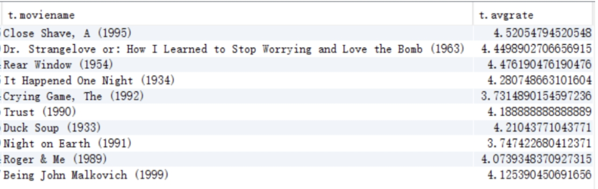

# HIVE 作业

作业要求和内容见 https://u.geekbang.org/lesson/162?article=403204

环境包括: Hive 2.1.1-cdh6.3.2、 [HUE](http://jikehadoop04:8889/hue)、 [数据集](jikehadoop04:/home/student/lajin/)

```shell
[student@jikehadoop01 ~]$ hive --service version
WARNING: Use "yarn jar" to launch YARN applications.
SLF4J: Class path contains multiple SLF4J bindings.
SLF4J: Found binding in [jar:file:/opt/cloudera/parcels/CDH-6.3.2-1.cdh6.3.2.p0.1605554/jars/log4j-slf4j-impl-2.8.2.jar!/org/slf4j/impl/StaticLoggerBinder.class]
SLF4J: Found binding in [jar:file:/opt/cloudera/parcels/CDH-6.3.2-1.cdh6.3.2.p0.1605554/jars/slf4j-log4j12-1.7.25.jar!/org/slf4j/impl/StaticLoggerBinder.class]
SLF4J: See http://www.slf4j.org/codes.html#multiple_bindings for an explanation.
SLF4J: Actual binding is of type [org.apache.logging.slf4j.Log4jLoggerFactory]
Hive 2.1.1-cdh6.3.2
Subversion file:///container.redhat7/build/cdh/hive/2.1.1-cdh6.3.2/rpm/BUILD/hive-2.1.1-cdh6.3.2 -r b3393cf499504df1d2a12d34b4285e5d0c02be11
Compiled by jenkins on Fri Nov 8 06:02:22 PST 2019
From source with checksum 75df142c785df1d0b37a9d40fe16169f
```


## 排坑日志

### GeekFileFormat短名注册

Hive可以自定义 `file format` 和 `SerDe`，以扩展文件格式和记录格式，扩展点如下图所示


扩展后的 `file format` 一般以下面方式应用在表创建 `CREATE TABLE` 语句可选项 `STORED AS` 中

```sql
[STORED AS file_format]

file_format:
  : SEQUENCEFILE
  | TEXTFILE    -- (Default, depending on hive.default.fileformat configuration)
  | RCFILE      -- (Note: Available in Hive 0.6.0 and later)
  | ORC         -- (Note: Available in Hive 0.11.0 and later)
  | PARQUET     -- (Note: Available in Hive 0.13.0 and later)
  | AVRO        -- (Note: Available in Hive 0.14.0 and later)
  | JSONFILE    -- (Note: Available in Hive 4.0.0 and later)
  | INPUTFORMAT input_format_classname OUTPUTFORMAT output_format_classname
```

很少见题目要求的geek短方式应用

```sql
create table ... stored as geek
```

搜索了很多 `file format` 方面的资料，一直没有找到怎样类似 SEQUENCEFILE 之类的短名，最终幸得老师提示，才弄明白这个问题实际是 `To add a new native SerDe with STORED AS keyword`, 中文意思就是 `扩展原生SerDe 的 STORED AS 关键字`。

具体注册过程：

1. 创建 storage format 描述类，以扩展 [AbstractStorageFormatDescriptor](https://github.com/apache/hive/blob/trunk/ql/src/java/org/apache/hadoop/hive/ql/io/AbstractStorageFormatDescriptor.java) 类方式，定义 `InputFormat`, `OutputFormat` 和 `SerDe` 类名。
2. 创建 [StorageFormatDescriptor](https://github.com/apache/hive/blob/trunk/ql/src/main/resources/META-INF/services/org.apache.hadoop.hive.ql.io.StorageFormatDescriptor) 注册文件，`SPI` 方式注册 `STORED AS` 的***短名***，也就是 ***keyword***。


### hive-exec依赖包缺失

org.pentaho:pentaho-aggdesigner-algorithm:pom:5.1.5-jhyde 缺失的解决方法：

```xml
<repositories>
    <repository>
        <id>spring</id>
        <url>https://maven.aliyun.com/repository/spring</url>
    </repository>
</repositories>
```


## 作业输出

### 准备工作

| 表名     | 记录数量 |
| -------- | -------- |
| t_user   | 6040     |
| t_movie  | 3883     |
| t_rating | 1000209  |

> t_rating 打分行为表较大，数据100M条


### 第一题

统计指定电影 (ID:2166) 各年龄段的平均影评分

```sql
SELECT u.age AS age, avg(r.rate) AS avgrate
FROM t_rating AS r
JOIN t_user AS u
ON r.userid = u.userid
WHERE r.movieid=2116
GROUP BY u.age
```


### 第二题

```sql
SELECT t.sex AS sex, m.moviename as name, t.avgrate AS avgrate, t.total AS total
FROM (
    SELECT u.sex AS sex, r.movieid as movieid, avg(r.rate) AS avgrate, count(1) AS total
    FROM hive_sql_test1.t_rating AS r
    JOIN hive_sql_test1.t_user AS u ON r.userid = u.userid
    WHERE sex = "M"
    GROUP BY movieid, sex
    HAVING total > 50
    ORDER BY avgrate DESC, total DESC
    LIMIT 10 ) AS t
LEFT JOIN hive_sql_test1.t_movie AS m ON t.movieid = m.movieid;
```


### 第三题

```sql
SELECT m.moviename as `moviename`, topavg.avgrate as `avgrate`
FROM (
    SELECT r3.movieid, avg(r3.rate) AS avgrate
    FROM (
        SELECT r2.movieid, r2.rate as rate
        FROM (
            SELECT r.userid as userid, count(1) as total
            FROM hive_sql_test1.t_rating AS r
            JOIN hive_sql_test1.t_user AS u ON r.userid = u.userid
            WHERE u.sex = "F"
            GROUP BY r.userid
            ORDER BY total DESC
            LIMIT 1) AS ladygaga
        JOIN hive_sql_test1.t_rating AS r2
        ON ladygaga.userid = r2.userid
        ORDER BY rate DESC
        LIMIT 10) AS top
    JOIN hive_sql_test1.t_rating AS r3 ON top.movieid = r3.movieid
    GROUP BY r3.movieid) as topavg
LEFT JOIN hive_sql_test1.t_movie AS m ON topavg.movieid = m.movieid;
```


> **TODO** 符合要求的电影实际有59部，不知题目描述中答案图是按照怎样的顺序排序的。
>
> PS: 尝试过按照movieid、times等排序，都不是
>
> 


## 参考资料

1. [HQL Language Manual DDL](https://cwiki.apache.org/confluence/display/Hive/LanguageManual+DDL) by HIVE offical site.
2. [Extend Base64TextFile FILE FORMAT Sample](https://github.com/cloudera/hive/tree/cdh5.8.0-release/contrib/src/java/org/apache/hadoop/hive/contrib/fileformat/base64) by github.com
3. [Registration of Native SerDes](https://cwiki.apache.org/confluence/display/Hive/DeveloperGuide#DeveloperGuide-RegistrationofNativeSerDes) by HIVE offical site.
4. [Defining Table Record Formats in Hive](https://www.dummies.com/programming/big-data/hadoop/defining-table-record-formats-in-hive/) by dummies.com

