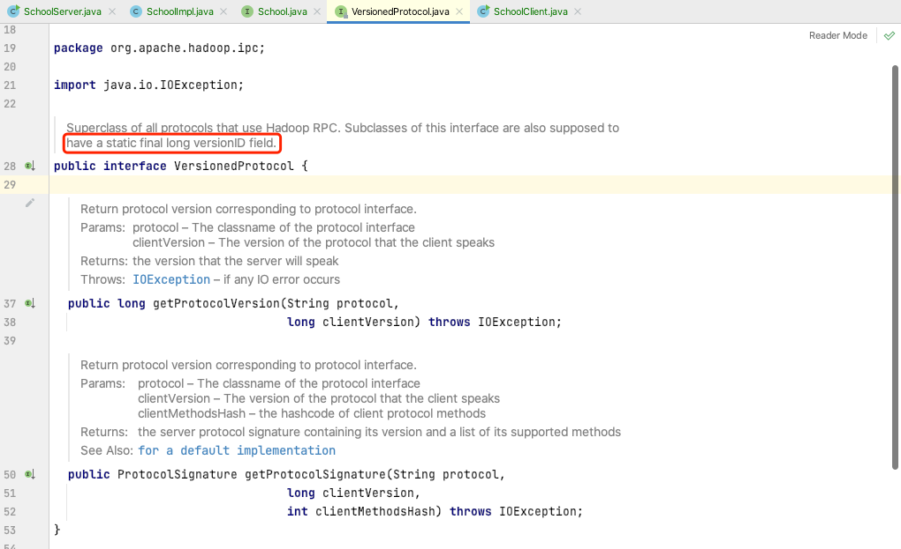
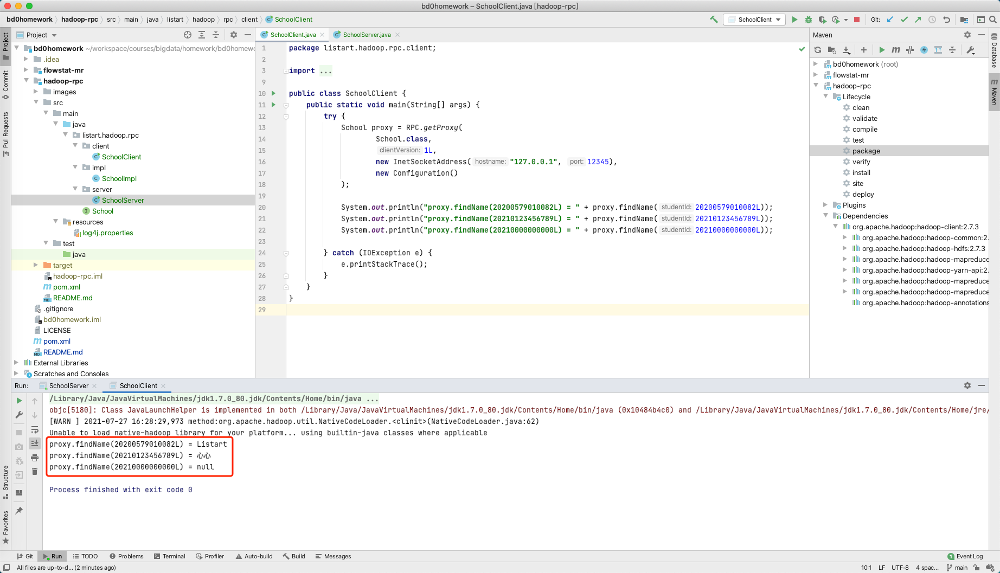
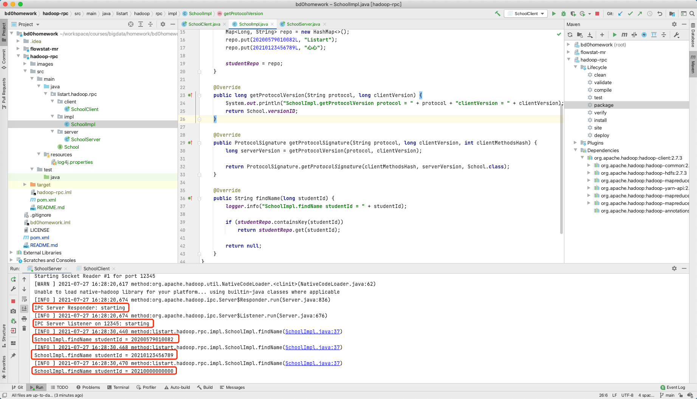

# Hadoop RPC 编程作业

作业内容和要求见 https://u.geekbang.org/lesson/162?article=397128


## 排坑记录

### NoSuchFieldException: versionID

```shell
Exception in thread "main" java.lang.RuntimeException: java.lang.NoSuchFieldException: versionID
	at org.apache.hadoop.ipc.RPC.getProtocolVersion(RPC.java:175)
	at org.apache.hadoop.ipc.WritableRpcEngine$Invocation.<init>(WritableRpcEngine.java:114)
	at org.apache.hadoop.ipc.WritableRpcEngine$Invoker.invoke(WritableRpcEngine.java:242)
	at com.sun.proxy.$Proxy4.findName(Unknown Source)
	at listart.hadoop.rpc.client.SchoolClient.main(SchoolClient.java:20)
Caused by: java.lang.NoSuchFieldException: versionID
	at java.lang.Class.getField(Class.java:1592)
	at org.apache.hadoop.ipc.RPC.getProtocolVersion(RPC.java:171)
	... 4 more
```

以为versionID是给实现自己用的，结果是接口要求



## 作业输出

测试步骤

1. 启动服务器

2. 启动客户端

   

3. 查看服务器日志

   


## 参考资料

确实资料稀少，不过源码中还是附带比较多的说明内容。