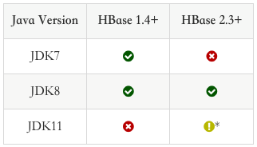

# HBase 编程实践

作业内容和要求见 https://u.geekbang.org/lesson/162?article=400096


## 排坑日志

### 集群连接配置

#### 配置代码模版

```java
Configuration config = HBaseConfiguration.create();
config.set("hbase.zookeeper.quorum", "localhost");  // Until 2.x.y versions
// ---- or ----
config.set("hbase.masters", "localhost:1234"); // Starting 3.0.0 version
```

> hbase `2.x.y` 主要配置 `hbase.zookeeper.quorum` 参数，端口缺省 `2181 ` 就无须配置。

#### 查询集群配置元数据

```shell
hbase(main):005:0> zk_dump
HBase is rooted at /hbase
Active master address: jikehadoop02,16000,1627199314951
Backup master addresses:
Region server holding hbase:meta: jikehadoop03,16020,1627199320796
Region servers:
 jikehadoop07,16020,1627199344846
 jikehadoop08,16020,1627199319098
 jikehadoop06,16020,1627199328542
 jikehadoop02,16020,1627199314940
 jikehadoop05,16020,1627199325811
 jikehadoop01,16020,1627199322080
 jikehadoop03,16020,1627199320796
 jikehadoop04,16020,1627199311813
Quorum Server Statistics:
 jikehadoop01:2181
  Zookeeper version: 3.4.5-cdh6.3.2--1, built on 11/08/2019 13:15 GMT
  Clients:
   /172.16.63.14:45168[1](queued=0,recved=19795,sent=19795)
   /172.16.63.18:57338[1](queued=0,recved=19004,sent=19004)
   /172.16.63.17:56074[0](queued=0,recved=1,sent=0)
   /172.29.173.89:53954[1](queued=0,recved=19051,sent=19056)
   /172.29.173.90:56342[1](queued=0,recved=72381,sent=72384)
   /172.16.63.14:45136[1](queued=0,recved=19043,sent=19048)
   /172.29.173.91:48182[1](queued=0,recved=19016,sent=19017)
  
  Latency min/avg/max: 0/0/83
  Received: 558140
  Sent: 641223
  Connections: 7
  Outstanding: 0
  Zxid: 0x200064650
  Mode: follower
  Node count: 73
 jikehadoop02:2181
  Zookeeper version: 3.4.5-cdh6.3.2--1, built on 11/08/2019 13:15 GMT
  Clients:
   /172.29.173.90:49426[1](queued=0,recved=19044,sent=19049)
   /172.16.63.14:48918[1](queued=0,recved=31206,sent=31241)
   /172.16.63.17:39084[0](queued=0,recved=1,sent=0)
  
  Latency min/avg/max: 0/0/63
  Received: 393146
  Sent: 476311
  Connections: 3
  Outstanding: 0
  Zxid: 0x200064650
  Mode: follower
  Node count: 73
 jikehadoop03:2181
  Zookeeper version: 3.4.5-cdh6.3.2--1, built on 11/08/2019 13:15 GMT
  Clients:
   /172.16.63.17:59650[1](queued=0,recved=8,sent=8)
   /172.16.63.15:35040[1](queued=0,recved=19057,sent=19064)
   /172.16.63.17:59802[0](queued=0,recved=1,sent=0)
   /172.16.63.16:35810[1](queued=0,recved=19036,sent=19038)
   /172.16.63.17:52204[1](queued=0,recved=19052,sent=19057)
   /172.16.63.17:59796[1](queued=0,recved=6,sent=6)
  
  Latency min/avg/max: 0/0/62
  Received: 401937
  Sent: 484982
  Connections: 6
  Outstanding: 0
  Zxid: 0x200064650
  Mode: leader
  Node count: 73
  Proposal sizes last/min/max: 36/32/648
Took 0.0799 seconds 
```

#### 配置代码

```java
Configuration config = HBaseConfiguration.create();
// hbase-client ver 2.1.0
config.set("hbase.zookeeper.quorum", "jikehadoop01,jikehadoop02,jikehadoop03");  
```


### Unsupported major.minor version 52.0

```shell
Exception in thread "main" java.lang.UnsupportedClassVersionError: org/apache/hadoop/hbase/HBaseConfiguration : Unsupported major.minor version 52.0
	at java.lang.ClassLoader.defineClass1(Native Method)
	at java.lang.ClassLoader.defineClass(ClassLoader.java:800)
	at java.security.SecureClassLoader.defineClass(SecureClassLoader.java:142)
	at java.net.URLClassLoader.defineClass(URLClassLoader.java:449)
	at java.net.URLClassLoader.access$100(URLClassLoader.java:71)
	at java.net.URLClassLoader$1.run(URLClassLoader.java:361)
	at java.net.URLClassLoader$1.run(URLClassLoader.java:355)
	at java.security.AccessController.doPrivileged(Native Method)
	at java.net.URLClassLoader.findClass(URLClassLoader.java:354)
	at java.lang.ClassLoader.loadClass(ClassLoader.java:425)
	at sun.misc.Launcher$AppClassLoader.loadClass(Launcher.java:308)
	at java.lang.ClassLoader.loadClass(ClassLoader.java:358)
	at listart.hbase.HBaseDemo.main(HBaseDemo.java:14)
```

原因是 `HBase 2.x` 版本早已需要 `JDK8` 版本了，具体可参考( [下图](https://hbase.apache.org/book.html#basic.prerequisites) )



调整到 `JDK8` 版本以后，执行成功。


## 作业输出

```shell
log4j:WARN No appenders could be found for logger (org.apache.hadoop.util.Shell).
log4j:WARN Please initialize the log4j system properly.
log4j:WARN See http://logging.apache.org/log4j/1.2/faq.html#noconfig for more info.
Creating table. 
org.apache.hadoop.hbase.NamespaceNotFoundException
Done. 
Saved Student{rowKey='10000000001202', name='Tom', id='20210000000001', classNum=1, understandingScore=75, programmingScore=82}
Saved Student{rowKey='20000000001202', name='Jerry', id='20210000000002', classNum=1, understandingScore=85, programmingScore=67}
Saved Student{rowKey='30000000001202', name='Jack', id='20210000000003', classNum=2, understandingScore=80, programmingScore=80}
Saved Student{rowKey='40000000001202', name='Rose', id='20210000000004', classNum=2, understandingScore=60, programmingScore=61}
Saved Student{rowKey='28001097500202', name='Listart', id='20200579010082', classNum=1, understandingScore=null, programmingScore=null}
Got Student{rowKey='10000000001202', name='Tom', id='20210000000001', classNum=1, understandingScore=75, programmingScore=82}
Got Student{rowKey='28001097500202', name='Listart', id='20200579010082', classNum=1, understandingScore=null, programmingScore=null}
Scan Student{rowKey='10000000001202', name='Tom', id='20210000000001', classNum=1, understandingScore=75, programmingScore=82}
Scan Student{rowKey='20000000001202', name='Jerry', id='20210000000002', classNum=1, understandingScore=85, programmingScore=67}
Scan Student{rowKey='28001097500202', name='Listart', id='20200579010082', classNum=1, understandingScore=null, programmingScore=null}
Scan Student{rowKey='30000000001202', name='Jack', id='20210000000003', classNum=2, understandingScore=80, programmingScore=80}
Scan Student{rowKey='40000000001202', name='Rose', id='20210000000004', classNum=2, understandingScore=60, programmingScore=61}
Deleting tom = Student{rowKey='10000000001202', name='Tom', id='20210000000001', classNum=1, understandingScore=75, programmingScore=82}
Done.
Scan Student{rowKey='20000000001202', name='Jerry', id='20210000000002', classNum=1, understandingScore=85, programmingScore=67}
Scan Student{rowKey='28001097500202', name='Listart', id='20200579010082', classNum=1, understandingScore=null, programmingScore=null}
Scan Student{rowKey='30000000001202', name='Jack', id='20210000000003', classNum=2, understandingScore=80, programmingScore=80}
Scan Student{rowKey='40000000001202', name='Rose', id='20210000000004', classNum=2, understandingScore=60, programmingScore=61}

Process finished with exit code 0
```

## 参考资料

1. [Client configuration and dependencies connecting to an HBase cluster](https://hbase.apache.org/book.html#client_dependencies) by Apache HBase Reference Guide
2. [Apache Hbase APIs and Examples](https://hbase.apache.org/book.html#hbase_apis) by Apache HBase Reference Guide